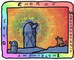

How did we get here? A very brief history of dark matter
==============

My research revolves around understanding dark matter and how it bends light through gravity. Below is a broad overview of some of the observational evidence for dark matter uncovered over the last century:

How do we detect dark matter? Seeing the invisible with gravitational lensing
==============

Dark matter is essentially invisble. To find it, we must look for its effects on the surrounding stars and galaxies. In fact, the gravity from dark matter bends the light of galaxies behind it in a phenomenon called gravitational lensing. By measuring the distortions in the background galaxies caused by the foreground dark matter, we can map where the invisible dark matter actually is, just like in the animation below:

<video width="720" autoplay loop muted playsinline>
  <source src="../files/GravLens_H2641080p.mov" type="video/mp4">
  Your browser does not support the video tag.
</video>

<em>Animation illustrating light from a cluster of galaxies being lensed by dark matter (Source: <a href="(https://svs.gsfc.nasa.gov/20244/"> NASA's Goddard Space Flight Center Conceptual Image Lab </a>).</em>

About me
==============

My research centres around understanding the Universe as a whole at the largest possible scales. I aim to uncover what the Universe is really made of by mapping its vast cosmic web and teasing out the hidden influence of dark matter and dark energy on billions of galaxies. By turning huge sky surveys and space-telescope images from the ESA Euclid and the James Webb space telescopes into tracers of how the scaffolding of the cosmos grows and bends light, I build the rigorous groundwork needed to test whether our current picture of the Universe and gravity is truly right or if something fundamental is still missing.

Specifically, I am interested in dark matter and its effect on the formation of large-scale and small-scale structure around galaxies. I modelthe observable effects such as strong gravitational lensing, weak gravitational lensing, and galaxy clustering. To this end, I develop simulations as well as Bayesian simulation-based inference pipelines with galaxy surveys such as Euclid, COSMOS-Web, and the Kilo-Degree Survey in mind, together with other various projects.

To learn more about my work, here is my [recent review of simulation-based inference in cosmology and astrophysics](../files/2025-05-25_sbi-intro_sbi-galev_maximilian_von_wietersheim-kramsta.pdf).

Here's an example of one of my recent talks:

I am a member of the following collaborations:

