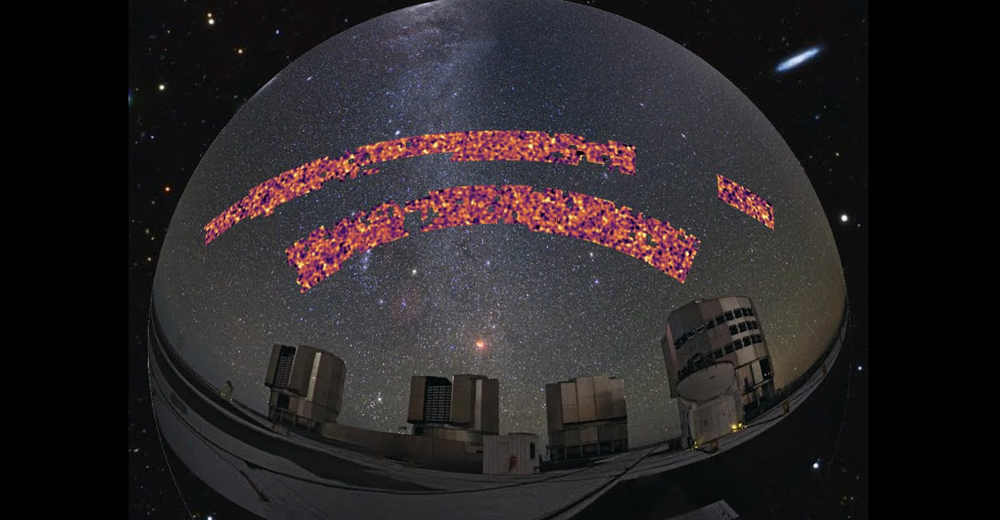
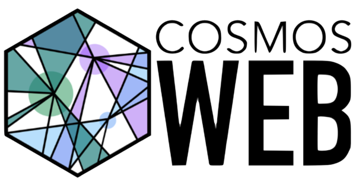

  <head>
    <title></title>
    <meta charset="utf-8">
        <meta name="viewport" content="width=device-width, initial-scale=1.3">
    
    
    
    
  </head>
  

    

      <!-- Indicators -->
      <ol class="carousel-indicators">
        <li data-target="#myCarousel" data-slide-to="0" class="active"></li>
        <li data-target="#myCarousel" data-slide-to="1"></li>
        <li data-target="#myCarousel" data-slide-to="2"></li>
      </ol>
      

        

          
          

            
JWST observation of the cosmic seahorse. Credit: ESA/Webb, NASA & CSA, J. Rigby

          

        

        

          
          

            
ESO Kilo-Degree Survey weak lensing data. Credit: ESO KiDS

          

        

        

          
          

            
Latest cosmological constraints from SBI analysis of KiDS-1000.

          

        

        
      

      <a class="left carousel-control" href="#myCarousel" data-slide="prev">
        
        Previous
      </a>
      <a class="right carousel-control" href="#myCarousel" data-slide="next">
        
        Next
      </a>
    

  

  

About me
==============

My research focuses on cosmology, understanding dark matter as well as its effect on the formation of large-scale and small-scale structure. I am interested in modelling the observable effects such as strong gravitational lensing, weak gravitational lensing, and galaxy clustering. To this end, I develop simulations of LSS, galaxy clusters, galaxies as well as simulation-based inference pipelines with future galaxy surveys in mind, together with other various projects.

Understanding the formation and evolution of structure at the largest scales allows us to determine how gravity and dark matter act on the cosmology of the Universe. Simultaneously, studying substucture formation at the scale of galaxies probes the nature of dark matter at small scales. Therefore, we can test Einstein's theory of general relativity as well as the theory of cold dark matter.

I am a member of the following collaborations:

